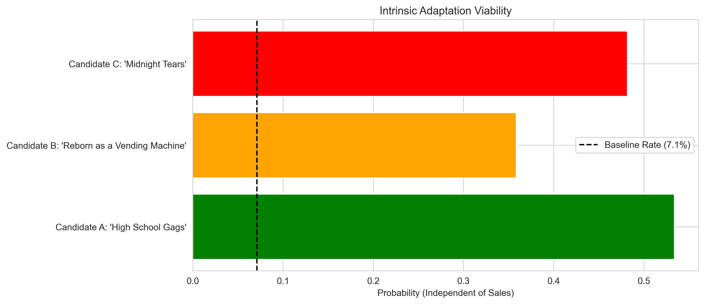
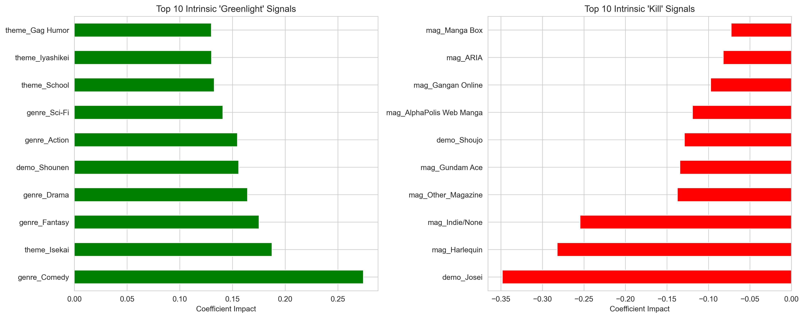

# Identifying Franchise Potential in Manga Source Material
**A Retrospective Classification Analysis of Community Metrics**

### Project Overview
The anime industry relies heavily on adapting existing manga into animated series, yet only a small fraction (~5-10%) of published works receive adaptations. This project builds a machine learning classification model to identify the statistical profile of manga most likely to sustain a multimedia franchise.

**Goal:** To distinguish the "signal" of a commercially viable property from the noise of the general market using historical community metrics.
**Status:** Completed (December 2025)

---

### Key Findings & Insights
* **The "Popularity" Signal:** Popularity metrics follow a Power Law distribution. Log-transforming member counts revealed a clear separation between adapted and non-adapted works, making it the strongest predictor.
* **The "One-Shot" Penalty:** Single-volume works (One-shots) have a near-zero adaptation rate compared to serialized manga (~8%), confirming that inventory volume is a critical factor for adaptation viability.
* **Genre Hierarchy:** *Shounen* and *Kids* demographics are adapted at nearly double the baseline rate, while *Josei* (adult women) underperforms, highlighting a commercial bias toward merchandise-friendly demographics.
* **Intrinsic Viability:** Even without sales data, structural features (Genre + Magazine + Volume Count) can predict adaptation viability with moderate success, suggesting that "concept fit" matters as much as raw popularity.


*Fig 1: Model predictions on hypothetical manga concepts. The model successfully flags high-potential combinations (e.g., Shonen Comedy) versus lower-viability niches, independent of popularity figures.*

---

### Methodology

#### 1. Target Variable Engineering (`is_adapted`)
Since the source dataset lacked a direct link between Manga and Anime entries, I engineered a ground-truth target variable using **Set-Based Entity Resolution**.
* **Method:** Constructed alias sets (English, Romaji, Synonyms) for all anime and checked for set intersections with manga titles.
* **Validation:** Manually audited edge cases (e.g., verifying *Attack on Titan* matched *Shingeki no Kyojin* while rejecting unadapted hits like *Vagabond*).

#### 2. Feature Engineering
* **Log-Transformation:** Applied `np.log1p` to the `members` column to normalize the extreme right-skew of popularity data.
* **Density Metrics:** Created `members_per_volume` to identify "dense" hits—works with high engagement despite a low volume count.
* **Categorical Pruning:** Used Frequency Pruning on high-cardinality columns (like `themes` and `genres`) to retain only statistically significant tags, reducing noise.

#### 3. Model Selection
I evaluated multiple models including Decision Trees, Random Forests, and Logistic Regression (Lasso).
* **Best Performer:** **Lasso Regression (L1 Regularization)**.
* **Why:** The linear model outperformed tree-based ensembles (F1-Score: **0.389** vs **0.375**), suggesting that the "Greenlight Formula" for anime adaptation is additive rather than complex/conditional.


*Fig 2: Top features driving the model's decisions. Positive values (Green) increase the likelihood of adaptation, while negative values (Red) significantly decrease it.*

---

### Results & Business Impact
The final model demonstrates that adaptation viability is predictable using public community metrics.
* **Survivorship Bias Identified:** Historical data from 1990–2010 shows an inflated adaptation rate (~18%), indicating that databases prioritize archiving successful franchises from the past.
* **Strategic Application:** This model can serve as a "First-Pass Filter" for acquisition teams, flagging high-potential works that fit the statistical profile of past hits before expensive licensing discussions begin.

---

### Setup & Usage
To run this analysis locally:

1.  Clone the repository:
    ```bash
    git clone [your-repo-link]
    ```
2.  Install dependencies:
    ```bash
    pip install -r requirements.txt
    ```
3.  Open the Jupyter Notebook:
    ```bash
    jupyter notebook analysis.ipynb
    ```

### File Structure
* `analysis.ipynb`: The main notebook containing all data cleaning, EDA, feature engineering, and modeling code.
* `data/`: Directory for storing raw and processed datasets (not included in repo for size/license reasons).
* `images/`: Exported figures used in this README.

---

### 📝 Conclusion & Future Work
This project successfully established a baseline for predicting media adaptations using unstructured community data. Future improvements could include:
* **Text Analysis:** Incorporating NLP on the `synopsis` column to detect plot archetypes (e.g., "Villainess" or "Battle Royale").
* **Temporal Splits:** Training on pre-2015 data and testing on post-2015 data to better simulate a real-world forecasting scenario.
